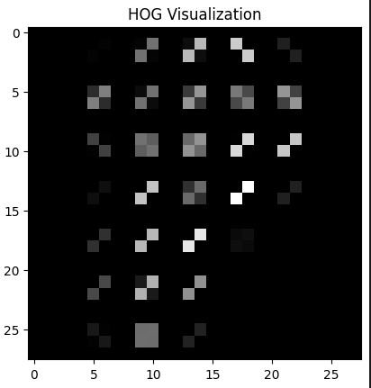

# HOG Feature Extraction and SVM Classification

Proyek ini bertujuan untuk melakukan klasifikasi karakter tulisan tangan berbasis fitur HOG (Histogram of Oriented Gradients) dan algoritma Support Vector Machine (SVM). Dataset terdiri dari 2600 gambar dengan 26 kelas, masing-masing 100 sampel (seimbang).

---

## 📂 1. Dataset Preparation

- Menggunakan **2600 Data** dengan ukuran 28x28 piksel.
- Setiap **kelas memiliki 100 data** (balanced).
- Dataset diacak sebelum diproses.
- Data dibagi menggunakan dengan:
  - **80% untuk training**
  - **20% untuk testing**
- Visualisasi gambar dilakukan sebelum dan sesudah ekstraksi fitur.

---

## 📈 2. Feature Extraction

- Fitur diekstrak menggunakan **HOG (Histogram of Oriented Gradients)**.
- Parameter HOG disesuaikan dari default:
  - `orientations = 8`
  - `pixels_per_cell = (4, 4)`
  - `cells_per_block = (2, 2)`
  - `block_norm = 'L2'`
- Gambar hasil visualisasi HOG ditampilkan untuk memahami fitur spasial yang diekstrak dari gambar.

---

## 🤖 3. Classification with SVM

- Digunakan algoritma **Support Vector Machine (SVM)** untuk klasifikasi.
- Parameter SVM yang dikustomisasi:
  - Kernel: `linear` dan `rbf`
  - Regularization (C): `1`, `10`
  - Gamma: `'scale'`, `'auto'`
- Digunakan **GridSearchCV** untuk mencari kombinasi parameter terbaik berdasarkan akurasi.

---

## 📊 4. Evaluation

Evaluasi dilakukan terhadap data **training (80%)** dan **testing (20%)** menggunakan metrik berikut:

- **Accuracy**
- **Precision**
- **Recall**
- **F1-score**

---

## 🖼️ Visualisasi HOG

Contoh visualisasi fitur HOG dibandingkan gambar asli:

| Original Image | HOG Visualization |
|----------------|-------------------|
|  |  |

> *Gambar visualisasi dihasilkan langsung dari hasil `skimage.feature.hog` dengan opsi `visualize=True`.*

---

## 🛠️ Requirements

- Python 3.x
- NumPy
- scikit-learn
- scikit-image
- matplotlib

```bash
pip install numpy scikit-learn scikit-image matplotlib
